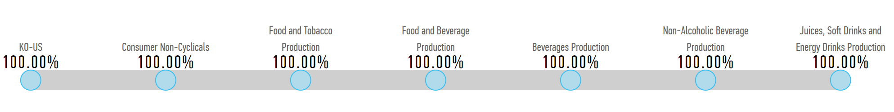
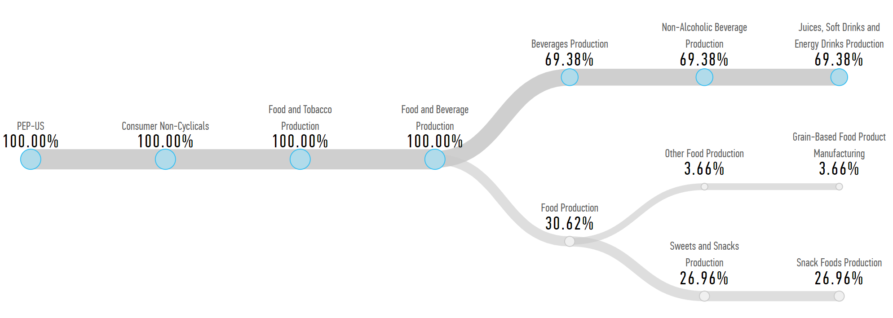
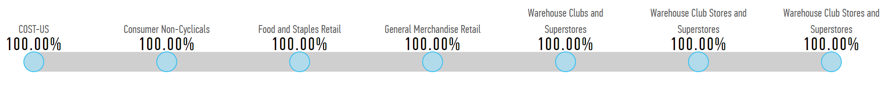
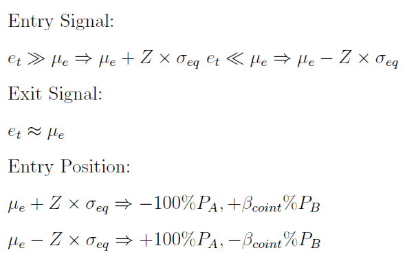
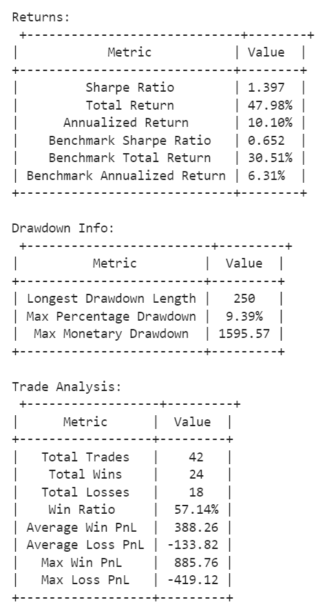
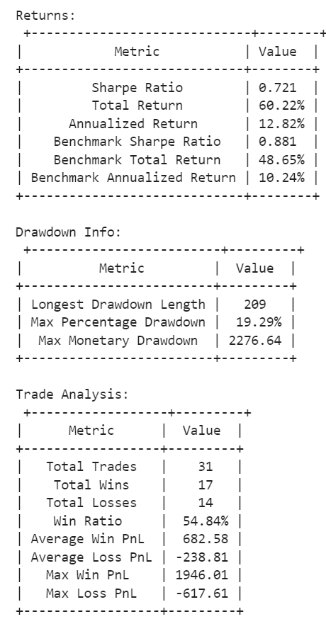
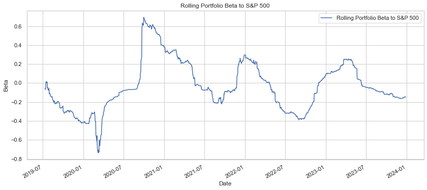
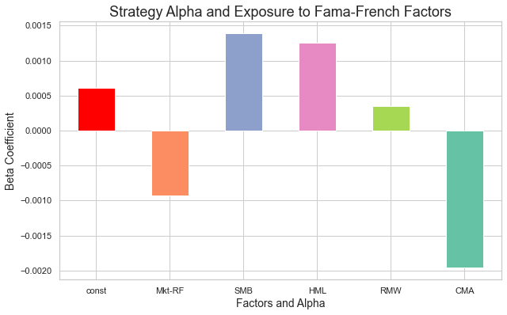

# Pairs-Trading-Strategy-Design-and-Backtesting

This project is focused on the development and backtesting of a Pairs Trading strategy, a market-neutral trading strategy enabling traders to profit from virtually any market conditions: uptrend, downtrend, or sideways movement. The notebook included in this repository walks through the entire process of identifying stock pairs, testing for cointegration, and then designing and backtesting the strategy.


## Pairs Selection

This strategy leverages **Coca-Cola (KO), Pepsi (PEP), and Costco (COST)** for pairs trading within the Consumer Staples sector, particularly the **XLP index**. These companies are chosen for their similar consumer markets and sectoral behaviors, with KO and PEP in beverages and COST in retail, all under the Consumer Non-Cyclicals umbrella. Their aligned market responses and RBICS Revenue profiles—highlighting operational niches in beverage production and retail—make them ideal for exploiting price discrepancies while managing risks.

<div align="center">
  
  <p>Figure 1: Coca-Cola RBICS Revenue</p>

  
  <p>Figure 2: PEPSI RBICS Revenue</p>

  
  <p>Figure 3: COSTCO RBICS Revenue</p>
</div>

## Data

We utilize 9 years of end-of-day data from Yahoo Finance, spanning from 2014 to 2023, for the selected stocks. This dataset is divided into an in-sample period (2014-2018) for parameter tuning and an out-of-sample period (2019-2023) for backtesting.

## Modelling

```
Engle-Granger Procedure
|
├── 1. Cointegration Assessment
|   |
|   ├── Regress Variable Y on X
|   |
|   └── Test Residuals for Stationarity (ADF Test)
|       |
|       ├── Stationary: Proceed to ECM
|       |
|       └── Non-Stationary: No Cointegration
|
└── 2. Error Correction Modeling (ECM)
    |
    ├── Model Short-term Adjustments
    |   |
    |   └── Use ECM to Link Changes & Lagged Error Term
```


### Stationarity and Cointegration

**Stationarity** of **residuals** is crucial for identifying **cointegration** between time series, indicating a stable long-term relationship despite short-term fluctuations.

- **Residuals Formula:**
  $$\text{Residuals: }\hat{e}_t = P^A_t - \beta_c P^B_t - \hat{\mu}_e$$
  Here, $\hat{e}_t$ represents the residuals at time $t$, $P^A_t$ and $P^B_t$ are the prices of assets A and B at time $t$, $\beta_c$ is the cointegration coefficient, and $\hat{\mu}_e$ is the estimated mean of the residuals.

- **ADF Test for Stationarity:**
  $$\text{ADF test: } \Delta y_t = \alpha + \beta t + \gamma y_{t-1} + \delta \Delta y_{t-1} + \epsilon_t$$
  The ADF test checks for unit roots to determine the stationarity of residuals, where $\Delta y_t$ is the difference in variable $y$ at time $t$, and $\epsilon_t$ is the error term.

- **Cointegration Vector and Equilibrium Level:**
  $$\text{Cointegrating vector: } \beta'_{\text{coint}} = [1, -\hat{\beta}_c]$$
  $$\text{Equilibrium level: } \mathbb{E}[\hat{\theta}_t] = \hat{\mu}_e$$
  The cointegrating vector shows the relationship between the variables, and $\mathbb{E}[\hat{\theta}_t]$ represents the expected equilibrium level, defined by the estimated mean $\hat{\mu}_e$.

### Error Correction Model (ECM)

The ECM is crucial for understanding how deviations from a long-term equilibrium relationship are corrected over time. It's represented by the following equations:

- **Basic ECM Equation:**
  $$\Delta P^A_t = \phi \Delta P^B_t - (1 - \alpha)\hat{e}_{t-1}$$

- **Expanded ECM Equation:**
  $$\Delta P^A_t = \phi \Delta P^B_t - (1 - \alpha) \left( P^A_{t-1} - \beta_c P^B_{t-1} - \mu_e \right)$$

```
Analysis & Trading Signals Generation
|
├── Signal Generation (Based on OU Process)
|   |
|   ├── Entry Signals
|   |
|   └── Exit Signals
|
└── Parameter Estimation
    |
    ├── Fit Data to OU Process
    |
    └── Calculate Mean Reversion Parameters
```




### Ornstein-Uhlenbeck Process Solution Overview

The solution to the Stochastic Differential Equation (SDE) of the Ornstein-Uhlenbeck (OU) process is pivotal in our analysis, providing insight into mean-reverting behavior. Here are the key equations:

- **SDE of OU Process:** 
  $$de_t = -\theta(e_t - \mu_e)dt + \sigma dX_t$$

- **Solution to the SDE:** 
  After applying an integrating factor and integrating, the solution is expressed as:
  $$e_{t+\tau} = e^{-\theta \tau} e_t + \mu_e (1 - e^{-\theta \tau}) + \sigma e^{-\theta (t+\tau)} \int_{t}^{t+\tau} e^{\theta s} dW_s$$

  This simplifies to:
  $$e_{t+\tau} = (1 - e^{-\theta \tau}) \mu_e + e^{-\theta \tau} e_t + \epsilon$$
  where $\epsilon$ is normally distributed noise.

- **For AR(1) Regression:** 
  Let $C = (1 - e^{-\theta \tau}) \mu_e$ and $B = e^{-\theta \tau}$, we model:
  $$e_{t} = C + B e_{t-1} + \epsilon$$

- **Equilibrium Standard Deviation:** 
  $$\sigma_{eq} = \sqrt{\frac{SSE \times \tau / T}{1 - e^{-2\theta\tau}}}$$

Further details and the derivation process are provided in the accompanying notebook.


## Systematic Backtesting

Our systematic backtesting uses data from 2014 to 2024, divided into training (2014-2018) and testing (2019-2024) segments for model development and performance evaluation, respectively. Our analysis employs Backtrader and PyFolio to gauge the strategy's effectiveness across different market conditions.

### In-Sample Backtest Highlights
- **Optimal Z value:** 0.2, yielding the highest Sharpe Ratio of 1.397 and total returns of 48%.
- **Performance:** The strategy surpassed the benchmark, achieving a Sharpe Ratio of 1.397 and a Cumulative Return of 47.98% against the benchmark's 0.652 Sharpe Ratio and 30.51% Cumulative Return.
- 

### Out-of-Sample Backtest Insights
- **Parameter Estimation:** Utilizes dynamic parameter estimation to avoid look-ahead bias, enhancing accuracy.
- **Results:** Despite a lower Sharpe ratio of 0.721, the strategy outperforms the benchmark in total (60.22%) and annualized returns (12.82%), but faced a significant drawdown during the 2020 market volatility.
- 

### Rolling Beta Analysis
- Demonstrates low market exposure, oscillating between -0.6 to 0.6, underscoring the strategy's market neutrality and focus on short-term inefficiencies.
- 

### Exposure to Fama-French 5 Factor Model
- Indicates statistically significant alpha and specific factor correlations, highlighting the strategy's nuanced performance within a market-neutral framework.
- 

This backtesting summary provides a snapshot of our pairs trading strategy's robustness, market neutrality, and potential for consistent returns, emphasizing the importance of strategic risk management.
